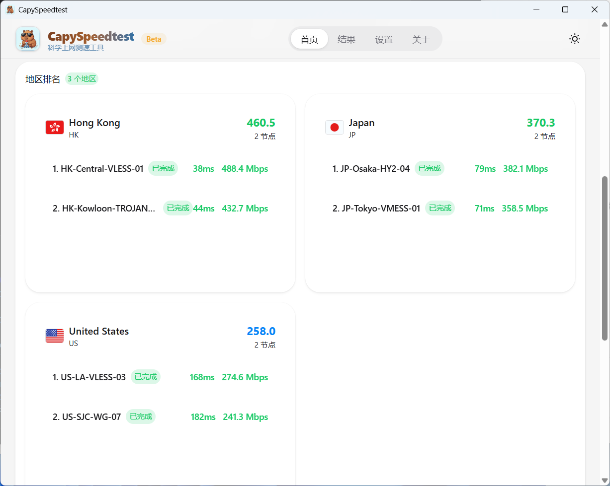
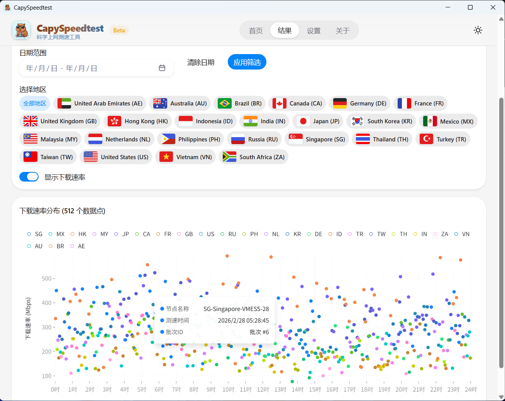
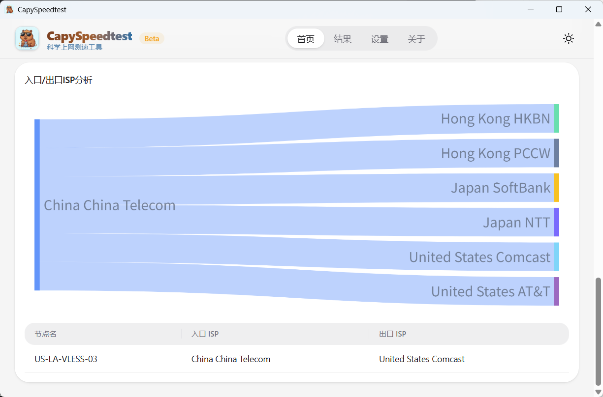


<div align="center">

# CapySpeedtest

跨平台科学上网测速工具

[](https://github.com/rroy233/capyspeedtest/releases)
[](https://github.com/rroy233/capyspeedtest/releases)
[](https://tauri.app/)
[](https://github.com/rroy233/capyspeedtest/releases/latest)

<p align="center">
  
</p>


</div>

## 功能

- 批量测速：支持手动粘贴节点或输入订阅链接，对科学上网节点进行批量测速。
- 多维指标：支持 TCP Ping、站点延迟、下载速率、上传速率、丢包率、NAT 类型检测。
- GeoIP 分析：展示入口/出口 IP、地区与 ISP 信息。
- 历史记录与可视化：以一种清晰直观的方式展现节点信息。
- 断点恢复：测速中断后可保存进度，后续可恢复测速过程。


|                      订阅拉取                      |                      地区排名                      |
| :------------------------------------------------: | :------------------------------------------------: |
|  |  |
|                     历史散点图                     |                      ISP 流向                      |
|  |  |

## 快速开始

1. 打开应用后进入“设置”页，先下载并启用可用的 Mihomo 内核。
2. 在“设置”页刷新 GeoIP 数据库。
3. 回到“首页”，选择输入方式：
   - 手动输入节点链接（每行一个）；
   - 或输入订阅 URL 后拉取节点。
4. 按需设置并发、超时、目标站点、是否开启上传测速。
5. 点击“开始批量测速”，等待实时进度完成。
6. 在“结果”页查看历史统计和批次明细。

## 下载和安装

### 系统要求

- Windows：Windows 10/11（x64）
- macOS：macOS 12.0 及以上（Apple Silicon / Intel）
- Linux：x86_64 或 arm64（建议使用较新的桌面发行版）

### 各平台下载安装

下载地址：<https://github.com/rroy233/capyspeedtest/releases/latest>

- Windows
  - 下载 `CapySpeedtest-<版本>-Windows.msi`
  - 双击安装包，按向导完成安装

- macOS
  - Apple Silicon 下载 `CapySpeedtest-<版本>-macOS-AppleSilicon.zip`
  - Intel 下载 `CapySpeedtest-<版本>-macOS-Intel.zip`
  - 解压后将 `CapySpeedtest.app` 拖入 Applications

- Linux
  - 可选 `CapySpeedtest-<版本>-Linux-<架构>.AppImage` 或 `.deb`
  - AppImage：
    - `chmod +x CapySpeedtest-*.AppImage`
    - `./CapySpeedtest-*.AppImage`
  - Debian/Ubuntu：
    - `sudo dpkg -i CapySpeedtest-*.deb`

### 从源码构建（开发者）

前置依赖：Node.js 18+、Bun、Rust 1.85+、Tauri 2 开发环境

```bash
bun install
bun run tauri dev
```

生产构建：

```bash
bun run tauri build
```

## Contributing

欢迎提交 Issue 和 Pull Request。

- 贡献指南：[`CONTRIBUTING.md`](./CONTRIBUTING.md)
- Bug 反馈：<https://github.com/rroy233/capyspeedtest/issues>
- 提交代码前建议运行：

```bash
bun run build
bun run test
cd src-tauri && cargo fmt --check && cargo clippy && cargo test
```

## 参考开源项目

- [MetaCubeX/mihomo](https://github.com/MetaCubeX/mihomo)
- [tindy2013/stairspeedtest-reborn](https://github.com/tindy2013/stairspeedtest-reborn)

## License

MIT
